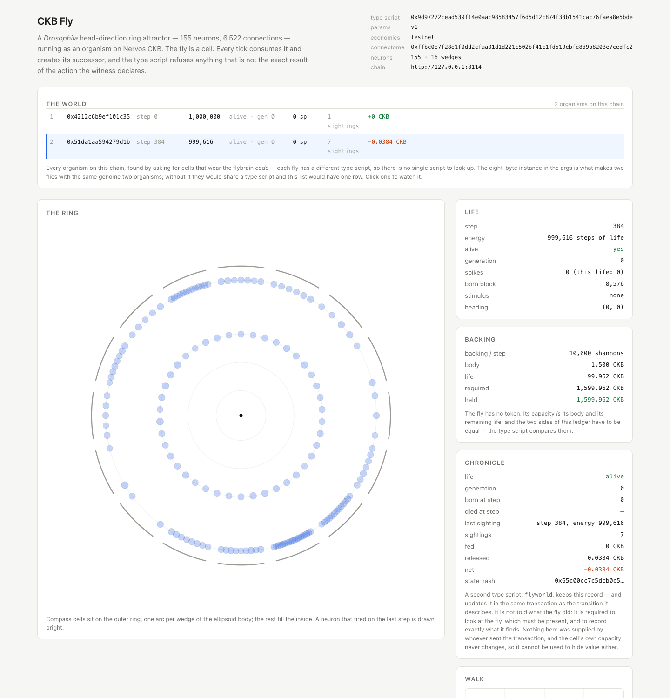

# CKB Fly

The *Drosophila* head-direction ring attractor — 155 neurons, 6,522 connections, 45,961
synapses from FlyWire release 783 — running as an organism on Nervos CKB.

This is a port of [`MidTermDev/immortal-fruit-fly`](https://github.com/MidTermDev/immortal-fruit-fly),
which runs the same circuit as integer leaky-integrate-and-fire neurons in the EVM on BNB
Smart Chain. The port is **bit-exact**: given the same actions, the CKB organism produces
the same membrane potentials, the same spikes and the same heading as the chain that came
before it, and the integration suite proves it by replaying real mainnet transactions.

There is no token. The fly's life is backed by CKB itself.

---

## Status

| phase | what | state |
|---|---|---|
| 0 | workspace, toolchain, build | done |
| 1 | bit-exact neural dynamics, validated against BSC mainnet | done |
| 2 | state cell, actions, type script, CKB-VM integration tests | done |
| 3 | native CKB economics (energy backed by capacity) | done |
| 4 | deployment: code cells, connectome table, genesis, live ticks | **done on preview testnet** |
| 5 | event layer: history recovered from the chain, and an indexer | **done** |
| 6 | front-end: the ring attractor, drawn from on-chain state | **done, against preview testnet** |
| 6b | the world: every organism listed, watchable, each with its own chronicle | **done** |
| 7 | world cell: a chronicle that the fly itself keeps honest | **done** |
| 8 | preview testnet deployment | **done** |
| 9 | a keeper, so the fly lives without a human in the loop | **done** |
| 9b | death and resurrection, exercised on a chain rather than only in tests | **done** |
| 9c | the lock as a genesis choice: a public `flylock` fly, or a private one only its key can advance | **done on preview testnet** |
| 9d | a visitor's own wallet drives the public fly: the server builds, the browser signs and pays | **done on preview testnet** |
| 10 | whole-brain disputable verification | blocked on the connectome, which is not in the repository |

`make test-all` runs 104 Rust tests and passes. `make test-deploy` runs 85 more, which pin
the JavaScript encoder and decoder against Rust. `make build` produces three RISC-V contract
binaries. `make build-front-end` bundles the page, which now carries CCC and two wallet
adapters (860 KB).

The organism has run end to end on a real node — not in a simulator: a dev chain built
from CKB 0.209.0, where `deploy/` deployed the code cells, the connectome table and a
newborn fly, replayed the BSC mainnet trajectory through it as real transactions, recovered
that whole life back out of the chain, and drew it. Every number matched. The same paths then
ran on preview testnet: `tick`, `stimulate` (213 neurons fired and the head moved), `feed`,
death, resurrection, keeper feed/resurrect, multi-organism roster and browser-side drive
safety. Both short-lived test organisms were brought through death and generation 1, a fifth
organism wears the deployer's own `secp256k1` lock — a private fly, moved from the page by the
same server that used to describe it as undrivable — and a *visitor's* key, with no wallet
extension involved, drove the public fly `321 → 353` while the deployer's balance moved by
zero. The current public testnet indexer is the only service left running; the local dev node,
miner and indexer were stopped.

---

## Quick start

```sh
make prepare          # rustup target add riscv64imac-unknown-none-elf
make test             # host tests, no RISC-V toolchain needed
make build            # cross-compile the contracts, strip, copy to build/release/
make test-all         # the above, plus the CKB-VM integration tests
make plan             # build `flyplan`, the transaction builder's oracle
make test-deploy      # pin the JavaScript encoder and decoder against Rust
make test-wasm        # the same flycore compiled to wasm, checked against flyplan
make build-front-end  # bundle deploy/public/app.source.js into public/app.js
```

`make build` needs `llvm-objcopy` to strip debug info. On macOS with Homebrew's LLVM it is
found automatically at `/opt/homebrew/opt/llvm/bin/`; without it the build still succeeds
but warns, because an unstripped binary would need a nineteen-million-CKB code cell.

`make test-deploy` needs `npm install` in `deploy/` first. See
[`deploy/README.md`](deploy/README.md) for deploying, driving, indexing and watching the
fly, [`docs/playing.md`](docs/playing.md) for what the five moves are, what each one
costs, and who pays whom, and [`docs/hosting.md`](docs/hosting.md) for putting the page on
the internet.

---

## Layout

```
crates/flycircuit     decoder for the 15,065-byte connectome table
crates/flycore        the organism: dynamics, state codec, actions, economics
crates/flyplan        host-side planner: state + action -> the bytes a transaction needs
crates/flywasm        the same flycore as a wasm module, for a page with no server behind it
contracts/flybrain    the type script that guards the state cell
contracts/flylock     the lock the state cell wears
contracts/flyworld    the chronicle: a record that has to look at the fly to write it
tests                 ckb-testtool integration suite (runs the real RISC-V binaries)
deploy                the chain half: build, sign, send, index, and serve the front-end
  src/cli.js          deploy, drive, and recover the fly's history
  src/history.js      the event layer: a life, read back out of the chain
  src/serve.js        the indexer and the page's host
  public/             the front-end: the ring, the heading, the walk
scripts/gen_fixture.py regenerates the mainnet differential fixture
```

`flycore` is `no_std`, allocation-free and has no dependencies beyond `flycircuit`. The
contract and the host tests execute the *same* code, so "the builder produced a valid
transaction" and "the validator accepted it" cannot drift apart.

---

## The port is bit-exact, and here is the proof

`crates/flycore/tests/fixtures/mainnet_v1.json` is generated by driving the upstream
bit-exact Python replica (`sim/flysim.py`) through the exact action sequence FlyBrain v1
(`0x32D28e97b50f5978eb51d7608492CC7221b01f63`) executed on BNB Smart Chain. The same
numbers are asserted by the upstream `Differential.t.sol`.

`replay_mainnet_v1_matches_every_neuron` asserts **every one of the 155 membrane
potentials, 155 engram values, 155 pending-input accumulators and 16 heading bins** equals
the fixture, at every tick boundary. Not just the spike counts — a port can match spike
counts while drifting in the sub-threshold regime, and the drift only becomes visible one
tick later.

`tick_reproduces_the_mainnet_cue_response` then does the same thing through the compiled
RISC-V binary inside CKB-VM:

| step | cumulative spikes | heading | position |
|---|---|---|---|
| `tick(64)` | 0 | — | — |
| `feed(10_000)` | 0 | — | — |
| `stimulate(CUE, wedge 4, strength 4, 32 steps)` | 279 | (−2446, 11821) | (−103, 501) |
| `tick(32)` | 533 | (−835, 11896) | (−138, 1011) |
| `tick(32)` | 533 | — | — |
| `stimulate(SHOCK, strength 4, 32 steps)` | 816 | (0, 0) | — |

The circuit's own identity is preserved too: `keccak256(circuit.bin)` is
`ffbe0e7f28e1f0dd2cfaa01d1d221c502bf41c1fd519ebfe8d9b8203e7cedfc2`, which is what the
deployed BSC contract reports from `circuitHash()` and what the CKB type script carries in
its args.

### Three subtleties that make a bit-exact port non-obvious

These are the things that will break a naive port. They are all pinned by tests.

1. **The noise byte order is reversed from how it reads.** `FlyBrain.sol` extracts noise
   with `and(shr(mul(and(i, 31), 8), rnd), 0xFF)` — shifting a 256-bit *number* right and
   masking, which walks the digest from the **least** significant byte upward. In
   big-endian byte order that is `rnd[31 - (i & 31)]`. Reading `rnd[i & 31]` compiles, runs,
   and produces a plausible fly that diverges from the chain on the first step where noise
   matters. The first `tick(64)` of the mainnet trajectory fires nothing, so it cannot catch
   the mistake; the cue tick can.
2. **`keccak256(abi.encodePacked(uint64))` is eight bytes**, not the 32-byte ABI-padded
   form. `keccak256(0u64.to_be_bytes())` is `011b4d03…`; `keccak256(bytes32(0))` is
   `290decd9…`.
3. **`stimulate(channel, param, strength, steps)`'s fourth argument is the number of steps
   to run immediately**, so `stimulate(1, 4, 4, 32)` means "stimulate, then tick 32". The
   upstream differential test's assertions only make sense read that way (192 total steps,
   energy `1_010_000 − 192 = 1_009_808`).

Two more, from the EVM's memory model:

4. **Values are wide in flight and narrow on write.** `v`, `bias` and `inp` are `int32[]`
   in EVM memory, but the assembly reads and writes full 256-bit words into those slots, so
   they accumulate at full width during a tick and are only narrowed when stored: `v`
   clamped to `i16`, `inp` truncated to `i32`, `bias` to `i8`. `flycore` computes in `i64`
   and narrows in `encode`.
5. **v1 never writes its pending-input slots.** Both `_loadInp` and `_storeInp` are behind
   `PERSIST_INPUT`, so a v1 organism's input region stays zero for its whole life. Writing
   the in-flight accumulator there would make the cell differ from the one BSC holds, and
   the difference would be invisible until someone compared cells byte for byte.

---

## The CKB design

### Two scripts, two jobs

CKB splits authority in two. A cell's **lock** decides who may consume it; its **type
script** decides what the transition must look like.

Upstream, *anyone* can call `FlyBrain.tick()`. If the state cell wore the owner's
`secp256k1` lock, only the owner could tick and the fly would be a private toy with a public
audience. So the state cell wears [`flylock`](contracts/flylock/src/main.rs) — a lock that
accepts every transaction — and every rule lives in the type script, where anyone can read
it and anyone can satisfy it.

That is safe because the type script requires the successor to wear **the same lock as the
input**. A ticker cannot redirect the fly to their own key, cannot destroy it (exactly one
successor is required), and cannot rewind it (the successor must be the exact result of
applying the declared action). The worst a griefer can do is advance the fly.

Because `output.lock == input.lock` is enforced, the lock is chosen once at genesis and can
never change. A deployer who wants a private fly creates the genesis cell under a
`secp256k1_blake160` lock instead; nothing else changes.

### Actions live in the witness

CKB has no EVM-style event log, and — more to the point — a validator that has to guess
what the caller intended cannot be strict. So the action is declared explicitly in
`WitnessArgs.input_type`, and the type script's job becomes a pure function check:

```
output.data == simulate(input.data, action)
```

Not "the output is plausible" — *identical*. There is no field an operator can nudge, no
step they can skip, no action they can invent. The witness is the input to that function,
not a claim about it.

| tag | action | payload | bytes |
|---|---|---|---|
| 1 | `Tick` | `steps: u16` | 3 |
| 2 | `Stimulate` | `channel: u8, param: u8, strength: u8, steps: u16` | 6 |
| 3 | `Feed` | `steps: u64` | 9 |
| 4 | `Resurrect` | `steps: u64, born_block: u64` | 17 |

Every action carries the number of steps to advance, because on CKB "stimulate and tick" is
one transaction, not two: a state cell can only be consumed once per version, so fusing the
actions is what keeps the fly moving at a predictable rate.

### The args are a genome, and a genome is not an organism

The type script's args are 97 bytes, and the first nine of them are worth explaining:

```text
[0]       u8   version (2)
[1..9]    8    instance — a nonce, so that two flies are two organisms
[9..41]   32   the 12 dynamics parameters
[41..73]  32   keccak256 of the connectome
[73..97]  24   the prices
```

The instance field was not in the first version, and its absence was invisible for exactly
as long as only one fly existed. Everything else in the args describes a **species** — two
flies with the same parameters, the same connectome and the same prices have the same type
script, and therefore the same identity as far as the chain is concerned. So "find the cell
wearing the fly's type script" finds an arbitrary one of them, and a keeper driving two flies
ticks first one and then the other. The step counter goes backwards. Nothing errors.

Upstream has no such ambiguity: each fly is its own contract deployment, so each has its own
address. The nonce is the CKB spelling of that address, and without it the "anyone can create
a new organism" promise below is not actually usable — two organisms would be
indistinguishable. The args version was bumped to 2 so that an old-format arg is *refused*
rather than misread as a fly with a nonsensical genome.

**The deployer then reintroduced the bug it had just been written to prevent.** `genesis`
minted a nonce only when the deployment record had no fly yet, and inherited the existing
one otherwise — so a second fly from the same genome was created wearing the first fly's type
script. Two live cells then wore one script, and `status` on the second fly reported the
first one's state: exactly the "finds an arbitrary one of them" failure described above, with
exactly the same silence.

It was found by creating a second fly and comparing type hashes, which is the check the
original design note implied and nobody had run. The fix is that `plan.mintInstance()` always
mints, and it lives next to `args` rather than in the CLI — the CLI is where the deployment
record is in hand, and therefore the place where inheriting looks reasonable.
`deploy/test/instance.test.js` pins the property (32 flies must be 32 type scripts) so the
next person to think inheriting is a tidy idea finds out immediately.

### What the type script checks

1. **One in, one out.** Exactly one input cell wears the type script and exactly one output
   does. No input means genesis; no output is refused, so the fly can never be destroyed.
2. **The lock is immutable.** `output.lock == input.lock`.
3. **The type script is immutable.** Same code hash, hash type *and* args — so the dynamics,
   the connectome and the prices cannot be swapped underneath a live fly.
4. **The connectome is what the args say it is.** The 15 KB table arrives as a `cell_dep`
   and its keccak256 must equal the hash in args. `Circuit::new` rejects a non-table in
   O(1), and the first blob that *does* look like a table must be the right one, so a
   transaction cannot make the search hash unbounded data by padding its `cell_deps`.
5. **The action is legal.** Range-checked against the parameters by the same code the
   transaction builder runs.
6. **The state transition is exact.**
7. **The economics is exact.**

Failure is reported as a distinct exit code per check (1–18), because a rejected
transaction's code is the only diagnostic CKB gives it.

### One thing about CKB that will surprise you

CKB forms script groups by **script hash**, and runs a script once per group — for type
scripts, across inputs *and* outputs. Change the args and you change the hash, so a
transaction that tries to repoint the fly at different parameters is judged **twice, by two
independent runs of the same code**:

* the original script's group holds the input and no output — the fly would have no
  successor, so `WrongOutputCount` (6);
* the tampered script's group holds the output and no input — which looks exactly like a
  genesis transaction, and is refused by the newborn check as `NotGenesis` (18), because a
  state that has already lived is not a newborn.

Both are legitimate refusals, and which one gets *reported* depends on the order CKB happens
to run the groups in. `tests/src/tests.rs` asserts the set rather than a single code, and
says so in a comment — asserting one code would be asserting something the protocol does not
promise.

The genesis check earns its keep here: without it, a tampered output group would have had
nothing to compare against and could have been installed as a fresh fly.

### Economics: energy is CKB, and there is no token

Upstream, feeding the fly means sending `$FLY` to `0x…dEaD`. The token exists for one
reason: to make a burn measurable. CKB already has a measurable, native quantity — a cell's
capacity — so the fly does not need a token.

```
required_capacity(energy) = body_capacity + energy * backing_per_step
```

* **Feeding** increases the state cell's capacity. The feeder's CKB is locked into the fly's
  body, and because the type script forbids destroying the body that value can never be
  recovered — burned, but *verifiably* burned, and the fly is visibly richer by exactly that
  amount.
* **Ticking** decreases the state cell's capacity by the life it consumed. The value that
  leaves the cell is the ticker's: folded into a change output, it makes ticking profitable.
  CKB charges by transaction *size*, not by cycles, so a 64-step tick costs no more to submit
  than a 1-step tick — which is what makes long ticks the rational choice.
* **Stimulating** costs extra *life*, in proportion to strength. The fly pays for being
  steered in the only currency it has.

The capacity delta is derived from the energies rather than from the requested step count:

```rust
release = (input.energy - output.energy) * backing_per_step
```

so the invariant `capacity == body + energy * backing` holds **by induction, for any
action, without case analysis**. That matters: an earlier version charged the stimulus in
capacity, which has to come out of the very capacity backing the remaining energy — the
arithmetic admits no solution for an exactly-backed fly. Charging in life removes the
problem rather than working around it.

This deletes an entire class of problems the EVM version had to live with: no supply
schedule, no liquidity pool, no slippage, no `approve`/`transferFrom` dance, no
front-running, and no way for a third party to change the rules by moving a pool. The fly's
whole economics is 24 bytes of parameters and one capacity comparison.

### The state cell

1,213 bytes of data, fixed layout, versioned:

```
off  size  field
  0     1  version
  1     1  n              neuron count, must equal circuit.N
  2     1  alive
  3     1  stim_channel
  4     1  stim_param
  5     1  pad            must be 0
  6     2  stim_strength
  8     4  generation
 12     4  head_x
 16     4  head_y
 20     4  pad            must be 0
 24     8  step
 32     8  energy
 40     8  total_spikes
 48     8  life_steps
 56     8  life_spikes
 64     8  born_block
 72     8  stim_until_step
 80     8  pos_x
 88     8  pos_y
 96    32  heading_hist   16 x u16
128   2n  v               155 x i16
128+2n  n  bias            155 x i8
128+3n 4n  inp             155 x i32
```

`state_len(n) = 128 + 7n`, i.e. `128 + 7 × 155 = 1_213`.

Two different sizes are worth keeping apart, because confusing them makes a body that is
smaller than its own data:

* **1,459 bytes** is what the cell serializes to as molecule — the `Cell` table's header,
  the `CellOutput` table's header and offsets, the four-byte length prefix on each `Bytes`,
  and the padding that aligns them. `tests/src/tests.rs` measures this rather than
  modelling it, because an earlier hand-derived estimate came out 32 bytes short: it forgot
  that `ScriptOpt` is itself a table with its own header.
* **1,384 CKB** is what the node actually charges, because CKB counts the payload and not
  the encoding around it (`util/gen-types/src/extension/capacity.rs`):

  ```text
  8                          the capacity field
  + 1,213                    the state
  + (0 + 33)                 flylock: code hash (32) + hash type (1), empty args
  + (97 + 33)                flybrain: the 97 bytes of args, plus the same 33
  = 1,384
  ```

  The body of 1,500 CKB covers that with 124 CKB of headroom. `deploy/` computes capacity
  by this rule, and a live node accepted the result.

Decoding is strict about `version`, `n` and the two pad bytes, so two different byte strings
cannot represent the same state — which is what lets the type script compare bytes rather
than fields.

---

## Deploying

### Two layers, and why the split is where it is

A CKB transaction has to carry the **exact** successor state, byte for byte, and the
**exact** capacity the economics allows. Anything else is refused. So whoever builds a
transaction must be able to compute the next state — and the only implementation of the
dynamics allowed to be authoritative is `flycore`, the crate the validator runs.

Hence the split:

| layer | what it does | where |
|---|---|---|
| `crates/flyplan` | turns a state and an action into the bytes a transaction needs | Rust, over `flycore` |
| `deploy/` | builds, signs and sends transactions | JavaScript, over CCC |

`deploy/` does **not** reimplement the simulation. It shells out to `flyplan` for the
state, the action witness, the type-script args and the capacity, and spends its own code
on the chain half — which is where a CKB SDK belongs. A JavaScript reimplementation of the
dynamics would be a second source of truth for the one thing the port is about.

`crates/flywasm` is the other way out of that constraint, and it is not a reimplementation
either: it is the same `flycore`, compiled to `wasm32-unknown-unknown`, so that a page with
no server behind it can compute the successor state itself. The rule above forbids a second
*implementation*; it does not forbid a second *target*. `make test-wasm` checks the module
against `flyplan` byte for byte, on inputs the contract accepts and on inputs it refuses.

The exception is `deploy/src/fly.js`, which *is* a JavaScript mirror of the encoders. It
exists for the half of the project that cannot shell out to Rust — a browser has to encode
a `stimulate` action and decode a state cell with no server — and `make test-deploy` fails
if it ever disagrees with Rust. That test found a real bug on its first run: `encodeArgs`
was writing a hex *string* into a byte buffer, one zero byte per character.

### Driving it

```sh
cd deploy && npm install

node src/cli.js plan                 # what would be deployed, no network
node src/cli.js deploy               # code cells, connectome table, first fly
node src/cli.js status               # read the fly
node src/cli.js tick 64
node src/cli.js stimulate 1 4 4 32   # channel 1 (cue), wedge 4, strength 4, 32 steps
node src/cli.js feed 10000
node src/cli.js resurrect 10000 1234
```

`CKB_RPC_URL`, `CKB_PRIVATE_KEY`, `CKB_NETWORK`, `FLY_MODE`, `FLY_PARAMS`, `FLY_ECON` and
`FLY_ENERGY` configure it. Against a locally initialised dev chain it discovers the
system scripts from block 0, because `ckb init` bakes a timestamp into the genesis cell and
every system cell's out point differs on every machine — so there is nothing to hardcode.

### The trap that cost the most: `hash_type`

`"data"` and `"data1"` both identify a code cell by `blake2b256` of its contents, so both
give a code hash you can reproduce by rebuilding. They do **not** give you the same machine:

| hash type | CKB-VM | ISA | writable segments |
|---|---|---|---|
| `data` | 0 | `IMC` | marked frozen |
| `data1` | 1 | `IMC` + bit manipulation | writable |
| `data2` | 2 | `IMC` + bit manipulation | writable |

The contracts are built with `-C target-feature=+zba,+zbb,+zbc,+zbs`, because the
hash-heavy inner loop is much cheaper with them. On VM 0 those instructions are not decoded
at all, so the script's control flow goes somewhere it should not and the failure surfaces
as:

```text
Verification failed Script(TransactionScriptError {
    source: Outputs[0].Type, cause: VM Internal Error: MemWriteOnExecutablePage })
```

The error names a *write*, which sends you looking at the heap. It is really an instruction
fetch from a page that is not executable — `check_permission` returns the same code for
both directions of a W^X mismatch.

**The integration tests cannot catch this.** `ckb-testtool` runs the newest VM and does not
implement CKB's `select_version`, which is the function that maps `hash_type` to a VM
version. A `hash_type: "data"` deployment passes all 21 CKB-VM tests and then fails on the
first real node. The port uses `data1`, which needs only `ckb2021`; the ISA is the same as
`data2`'s, which would additionally require `ckb2023`.

### The event layer: a fly's past is its chain

Upstream, the live view, the replay and the death record were all built on three EVM
events. The migration plan flagged their loss as the most under-estimated piece of the
port, and it was right: CKB has no event log, and no amount of wishing produces one.

The replacement is not a log. It is the chain. **A fly is a chain of state cells** — each
transition consumes one and creates its successor — so walking backwards from the current
cell through each transaction's fly input recovers the entire life, in order, with no gaps.
The action comes back for free, because it is in the witness, and a witness is not a claim
about what happened: it is the input the type script validated before it agreed.

```sh
cd deploy && npm run history
```

```text
  #  block    action                                   step   energy      spikes  head
   0      409  genesis (no fly consumed)                    0    1000000       0  (0, 0)
   1      416  tick(64)                                    64     999936       0  (0, 0)
   2      428  feed(10000)                                 64    1009936       0  (0, 0)
   3      434  stimulate(ch 1, p 4, str 4, 32 steps)       96    1009392     279  (-2446, 11821)
   4      437  tick(32)                                   128    1009360     533  (-835, 11896)
   5      444  tick(32)                                   160    1009328     533  (0, 0)
   6      447  stimulate(ch 4, p 0, str 4, 32 steps)      192    1008784     816  (0, 0)
```

Nothing in that table was emitted by anything. Every row is a state cell that exists, and an
action that a validator read — and `flyplan decode-action` refuses anything the contract
would have refused, so the indexer cannot report an action the fly would have rejected.

### The front-end: the ring, drawn from cells



`npm run serve` indexes the fly and hosts a page from the same origin — which is not
laziness: a page talking to a CKB node directly needs that node to allow CORS, and a dev
chain may not be. The page draws the ring of 155 neurons (compass cells outside, one arc per
wedge of the ellipsoid body; the rest inside, grouped by cell type), the population vector
that is the fly's heading, and the path those headings have carried it along. Colour is
membrane potential; a neuron drawn bright fired on the last step.

The *Backing* panel is the economics, shown rather than asserted: the cell's capacity and
`body + energy × backing` side by side, because the type script compares them for equality
and they had better agree. In the screenshot both read 1,599.962 CKB.

Above it, *The world* lists every organism on the chain, found by asking for cells that wear
the flybrain **code** — each fly has a different type script, so there is no single script to
look up. That list is what the instance nonce buys: before it existed, two flies with the
same genome shared a type script and the roster could not be built at all. Clicking a row
switches the page to that organism, and the server re-walks *its* chain, which is a different
chain of cells from the one it was reading a moment ago.

Nothing on it is simulated. Between two on-chain states the page interpolates, and that
smoothing is the only thing on the page that is not literally a number from a cell.

With `INDEXER_ALLOW_DRIVE=1` the page can also drive the fly: a button posts to the
indexer, which plans the transaction with `flyplan`, signs it and sends it, and the
indexer notices the new cell on its next poll and pushes it to the page over SSE. The whole
loop — browser button, planner, transaction, node, indexer, page — is exercised by clicking
a button.

### Keeping it alive

Upstream's first roadmap goal is "the genesis fly is continuously alive, visibly, without a
human in the loop". `npm run keeper` is that:

```sh
cd deploy && npm run keeper
```

```text
  tick    1  step     64  energy    999936  spikes       0  +0.0064 CKB
  tick    2  step    128  energy    999872  spikes       0  +0.0064 CKB
  ...
ledger
  ticks         6
  released      0.0384 CKB  (taken from the fly)
  added         0 CKB  (put back)
  net           0.0384 CKB
  fees paid     0.0001431 CKB  (6 transactions)
  per action    fee 0.00002385 CKB
  margin        0.0064 CKB released per tick against 0.00002385 CKB of fee (profitable by 268×)
```

Three things it does that are not obvious:

* **It retries.** A CKB cell is a UTXO, so the same version of the fly can be spent exactly
  once. Two keepers — or one keeper and a visitor with the page open — cannot both tick it;
  one wins and the other's transaction names a cell that no longer exists. That is the model
  working, not an error, so a lost race is counted and the loop re-reads.
* **It measures its own fee** from the transactions it sent, rather than from its balance. A
  balance measures everything a key did: on a dev chain the mining reward goes to the same
  key, which turned the first version of this report into a rise of 601,318 CKB in seventeen
  seconds and a "fee" of minus six hundred thousand.
* **It does not resurrect by default.** Reviving a dead fly means buying it a life the keeper
  cannot get back, so it stops and says so unless `KEEPER_RESURRECT=1`.

And the honest conclusion, which the ledger states rather than hides: **a keeper's reward is
exactly the life it burns**, because the release and the feeding price are the same number.
`net` should be near zero — the fly is a conduit, not an income. The fee is the real cost, and
it is the number to weigh against whatever a feeder is willing to put in.

### It ran

On a dev chain built from CKB 0.209.0, `deploy/` created the two code cells and the
connectome table, then a newborn million-step fly, then replayed the BSC mainnet trajectory
through it — the same action sequence the differential tests use, this time as real
transactions:

| action | step | energy | spikes | heading |
|---|---|---|---|---|
| `tick(64)` | 64 | 999,936 | 0 | — |
| `feed(10_000)` | 64 | 1,009,936 | 0 | — |
| `stimulate(CUE, wedge 4, strength 4, 32)` | 96 | 1,009,392 | **279** | (−2446, 11821) |
| `tick(32)` | 128 | 1,009,360 | **533** | (−835, 11896) |
| `tick(32)` | 160 | 1,009,328 | **533** | — |
| `stimulate(SHOCK, strength 4, 32)` | 192 | 1,008,784 | **816** | — |

Every spike count and both heading vectors are the values BNB Smart Chain recorded.

The economics held exactly, which is the part worth checking rather than admiring. The
final cell held `160,087,840,000` shannons:

```text
150,000,000,000   the body
+  10,087,840,000  1,008,784 steps of life × 10,000 shannons
= 160,087,840,000
```

Not approximately — the same integer the node reported. The invariant
`capacity == body + energy × backing` survived six transitions including a feed, two
stimuli and a tick that ran the fly to the end of its life.

### It died, and it came back

The upstream claim the whole project is named after is that nothing is ever lost. That is a
claim about the *death path*, and the death path is the one a happy demo never reaches — the
million-step fly takes fifteen thousand ticks to run out. So a second fly was born with
**192 steps of life**, which three maximum ticks exhaust:

```text
  #  block    action                                   step   energy      spikes  head
   0     9323  genesis (no fly consumed)                    0        192       0  (0, 0)
   1     9331  tick(64)                                    64        128       0  (0, 0)
   2     9334  tick(64)                                   128         64       0  (0, 0)
   3     9337  tick(64)                                   192          0       0  (0, 0)
   4     9350  resurrect(1000, born 9347)                 192       1000       0  (0, 0)
```

Nothing in that table was emitted. Row 4 is not the indexer's reading of what a transaction
meant: it is the witness the type script validated before it agreed to the transition, read
back out of a state cell that exists.

Four things are worth pulling out of it.

**The corpse held exactly its body.** After the third tick the cell's capacity was
`150,000,000,000` shannons — `body_capacity` to the shannon, with no life left in it. The
invariant does not merely hold; it lands on the floor exactly.

**A dead fly refuses to move, and it refuses *before* spending anything.** Asking for another
tick does not produce a failed transaction on chain, it produces a refusal from the planner:

```text
flyplan: the contract would refuse this action: Dead
```

The same code runs in the transaction builder and in the validator, so the caller is told
what the chain would have said without paying to find out.

**Resurrection does not move time.** `step 192 -> 192`. The new life starts at the step the
old one ended, `life_steps` resets to zero, and the generation increments — which is what
makes the two lives comparable rather than one long life with a gap in it.

**The chronicle recorded the death without being told.** `flyworld` is not handed a
description of what happened; it is required to *look at* the fly in the same transaction.
After the resurrection it reads `alive, generation 1`, `born at step 192`, `fed 0.1 CKB`,
`released 0.0192 CKB`, `net +0.0808 CKB` — and `0.1 − 0.0192 = 0.0808`, so the ledger closes
against the fly's own capacity rather than against anything the deployer said.

### Does a ticker actually get paid?

This is worth answering from the chain rather than from the model, because the model has a
trap in it that I walked into. CKB will not create a change cell whose capacity does not
cover its own occupied size — about 41–61 CKB depending on the lock — and a 64-step tick
releases 0.0064 CKB. From that, it is easy to conclude that the reward is uncollectible and
a keeper has to batch.

**It is not, and it does not.** A real tick from the dev chain:

```text
inputs   [0] fly       160,000,000,000
         [1] chronicle 100,000,000,000
         [2] ticker     20,098,766,056,876
outputs  [0] fly       159,999,360,000
         [1] chronicle 100,000,000,000
         [2] change     20,098,766,694,499
fee 2,377 shannons
```

The change is **637,623 shannons larger** than the input it came from, and
`640,000 − 2,377 = 637,623`. The ticker collected the released value in full.

The minimum-cell rule applies to *creating* a cell, not to *funding* one. A ticker that
keeps any working balance already has an output for its change, so the surplus is added to
it and nothing new has to be created. The reward is 640,000 shannons against a 2,377
shannon fee — a margin of about 270×, which is what makes a keeper rational.

### The part that is *not* free

A keeper's reward is exactly the life it burns, because the release is priced at
`backing_per_step` — the same number that feeding costs. So a keeper that both ticks the fly
and feeds it when it runs low **breaks even**, minus fees. Ticking is not a business; it is
a service someone has to want.

Which makes the chronicle's `net` the interesting number:

```text
fed       1 CKB          capacity that has gone into the fly, from feeders
released  0.1216 CKB     capacity that has left it, to tickers
net       +0.8784 CKB    people have fed it more than tickers took
```

A fly lives exactly as long as that `net` is positive. Its metabolism is priced, its
caretaker is compensated, and whether it is immortal is a question with a number attached —
which is the whole design in one line.

---

## The world cell: a record that has to look

Upstream, the whole brain runs on an operator's machine and `FlyWorld.sol` holds the
operator's **checkpoints** — a hash of the entire brain state, the position, the energy, the
age. Its own comment says that anyone holding the published snapshot can re-run the model
and verify the hash.

They can. But `checkpoint()` is `operator`-only and its body is a series of assignments.
There is no bond to lose, no window in which to object, and no way for a disagreement to
reach the chain. Verification that nobody can compel is a promise, not a mechanism.

A CKB type script sees the entire transaction, so it does not have to be *told* what a fly is
doing. `flyworld` guards a **chronicle** cell, and every field of it is derived from the
fly's own state header, the fly's own state hash and the fly's own capacities on both sides
of the transition — all of them present in the same transaction, all of them already
validated by `flybrain`'s type script:

```
chronicle, 128 bytes
  0     1  version (1)
  1     1  alive
  2     2  pad
  4     4  generation
  8     8  born_step          the step the current life began at
 16     8  died_step          0 while alive
 24     8  step               the fly's step at the last sighting
 32     8  energy
 40     8  life_steps
 48     8  total_spikes
 56     8  capacity           the fly's capacity at the last sighting
 64     8  total_released     capacity that has left the fly, to whoever ticked it
 72     8  total_added        capacity that has gone into the fly, from whoever fed it
 80     8  sightings
 88     8  pad
 96    32  state_hash         keccak256 of the fly's state at the last sighting
```

The chronicle cannot record a sighting of a fly that is not there, cannot report a death
that has not happened, cannot invent a generation, and cannot claim a state hash the fly
does not have. It also cannot hold value — its own capacity must be identical on both sides,
because a record that can accumulate money is a record that can be used to hide it. The
worst a transaction can do is decline to update it.

Three details that are deliberate:

* **No action in the witness.** Whether this is an opening or a sighting is structural: no
  input in the group means the chronicle is being opened, exactly as in `flybrain` no input
  means genesis.
* **A chronicle cannot be opened late.** `open` requires the fly to be an *output* and not an
  input, so the only transaction that can begin one is the transaction that creates the fly.
  Its `born_step` is a claim about a birth, and the only moment the chain can witness a birth
  is the moment it happens.
* **It reads a header, not a simulation.** The world script has no connectome and needs none:
  it reads the fixed offsets of the fly's state and stops. A 15 KB `cell_dep` is a fine price
  for the script that *runs* the fly and a silly one for a script that only wants to know
  whether it is alive.

On a dev chain, seven transitions of the mainnet replay left the chronicle reading exactly:

```text
life          alive, generation 0
born at step  0
last sighting step 192, energy 1,008,784
sightings     7
fed           1 CKB
released      0.122 CKB
net           +0.878 CKB
```

Every one of those numbers is the fly's, and the arithmetic is exact: 10,000 steps of life
bought for 1 CKB, 64-step ticks releasing 0.0064 each, stimuli charged 512 steps of life per
unit of strength.

### What it does not solve, and why

**The whole-brain phase is blocked on data, not on design.** For the 155-neuron circuit the
fly's state lives in a cell, so there is nothing to dispute: the chain can simply be asked.
For a 166,700-neuron brain the state would be roughly a megabyte and a step costs millions of
cycles, so the operator's claim would be the only thing on chain — and making *that*
disputable needs a window replay, which needs the connectome.

That data is not in the repository this port was made from. `web/public/assets/` holds a
*render subset* of about 42,000 somata for the website's point cloud, and the file it was
generated from — `brain/connectome_783.npz` — is not checked in. Upstream's own first
principle is that every neuron must have a real FlyWire root id, so the connectome cannot be
invented to fill the gap.

What is here is the part that can be built honestly. The mechanism generalises — a challenge
is just another transaction that has to satisfy a type script, and `flybrain` already takes
its circuit from a `cell_dep` and its parameters from its args, so it would run a larger
connectome without a line of change — but the generalisation is waiting on data.

---

## Measured numbers

Everything below is measured, not estimated. Cycles come from `ckb-testtool`'s
`verify_tx`, which runs the same CKB-VM a node runs.

| quantity | value |
|---|---|
| `flybrain` binary | 64,736 bytes (stripped) |
| `flylock` binary | 20,736 bytes (stripped) |
| genesis transaction | 1,158,678 cycles |
| 64-step tick with an active stimulus | 6,555,537 cycles — **9.4% of the 70,000,000 per-transaction policy limit** |
| state cell data | 1,213 bytes |
| state cell serialized | 1,459 bytes of molecule, 1,384 bytes of occupied capacity |
| state cell capacity at genesis | 1,600 CKB (1,500 body + 100 for 10⁶ steps) |

CKB's fee is `1,000 shannons per KB` of transaction size, and cycles are a *limit*, not a
price. A state-transition transaction is a few kilobytes, so it costs a ticker a few
thousand shannons to submit and pays it 640,000 — a 64-step tick releases 0.0064 CKB. A
hundred and sixty ticks earn a CKB.

One-time deployment, all refundable in principle but locked in practice:

| cell | CKB |
|---|---|
| `flybrain` code cell | 64,797 |
| `flylock` code cell | 20,797 |
| connectome table cell | 15,126 |
| genesis state cell | 1,600 |
| **total** | **102,320 CKB** |

Those are the numbers `deploy/src/cli.js plan` prints, and the ones the dev chain accepted.
The code cells are larger than the binaries by 61 CKB each: that is the capacity field
(8 bytes), the deployer's `secp256k1_blake160` lock (20 bytes of args plus a code hash and
a hash type) and the cell's own bookkeeping.

---

## Where this deliberately differs from upstream

| upstream | here | why |
|---|---|---|
| `tick()` is free and idempotent | a tick consumes the state cell and creates its successor, so the same version can be spent once | CKB's cell model. A ticker must handle contention; the state is a UTXO, not a mutable slot |
| anyone can call `tick()` | anyone can *build* the transaction; the type script is the authority | the same guarantee, expressed in CKB's terms |
| stimulus priced in `$FLY` | priced in the fly's life | a capacity-denominated charge would break the energy backing invariant |
| `_feed()` has no `alive` check | feeding a corpse is refused | upstream burns tokens for nothing; on CKB that would be an irreversible destruction of coins |
| `resurrect(0)` burns the full price, then dies again | `Resurrect` requires non-zero energy | same |
| events (`Ticked`, `Fed`, `Died`) | none | CKB has no event log. History is rebuilt from cell history, which is data an indexer already has |
| `brainStateHash()` over the neuron arrays | keccak256 over the whole canonical cell | a strict superset: also commits to energy, position, heading history and the active stimulus |
| `FlyWorld.checkpoint()` is `operator`-only and asserts | `flyworld` derives every field from the fly in the same transaction | an attestation nobody can compel is a promise; a record that has to look is a fact |
| `FlyWorld` holds food, checkpoints and a roster in one contract | the chronicle holds no value at all | CKB can enforce "a record is not a bank" in one comparison, so it does |

The neural trajectory itself is **not** in this table. It is identical.

---

## Roadmap

* **Preview testnet.** The same `deploy/` run against `CKB_NETWORK=preview` and
  `CKB_RPC_URL=https://testnet.ckb.dev/`, with the genesis transaction and the resulting
  code hashes recorded. `node src/cli.js key` makes the key, prints the address and the exact
  cost, and tells you where to fund it. The one step a program cannot do is the faucet's
  GitHub login — after that it is `node src/cli.js deploy`. Nothing in the code changes.
* **JoyID.** The page drives the fly with a local key, which is right for a dev chain and
  wrong for anything else. On testnet the natural signer is JoyID — a passkey, no key on the
  server — and `@ckb-ccc/core` already carries it. What is missing is not the signing: it is
  the decision about what a *player* is allowed to do, which the current design answers
  maximally (anyone may tick, because upstream anyone could) and which a real front-end
  probably wants to shape.
* **A keeper.** The page advances the fly one click at a time. A keeper ticks on a
  schedule, feeds when the fly runs low, and retries when someone else got there first —
  because a state cell is a UTXO and two tickers cannot both win. `deploy/src/keeper.js`
  does this and keeps a ledger, so the economics above is a running measurement rather than
  an argument.
* **Whole-brain disputable verification.** The 139,248-neuron brain is about 9M cycles per
  step, so a **7-step window is ~63M cycles and fits inside the 70M per-transaction limit** —
  which is what makes a challenge-response scheme practical rather than theoretical. This is
  the phase the whole design was shaped around, and it is **blocked on the connectome**: the
  repository carries a render subset of the brain for the website's point cloud, not the
  166,700-neuron wiring, and upstream's first principle forbids inventing it. `flybrain`
  already takes its circuit from a `cell_dep`, so a larger connectome would not need a line
  of contract change — only the data, and a challenge protocol on top of the chronicle.
* **A time anchor for the chronicle.** `header_deps` were the plan for `block.number`, and
  they were dropped deliberately: a transaction cannot reference the block it will be mined
  in, so any block number it carried would be a lower bound at best, while the fly's own
  `step` is exact and means something to a simulation. A *death certificate* that says "no
  earlier than block N" is worth having, but it is a different feature from the record.
* **Extensions.** The giant-fiber escape circuit, mushroom-body plasticity, a multi-fly
  factory. Genesis already allows anyone to create a new organism, so the factory is a
  front-end, not a contract change — `deploy/src/cli.js genesis` already does it from a
  terminal.

---

## Reading order

If you want to understand the port, read in this order:

1. `crates/flycore/src/sim.rs` — the dynamics, with the three subtleties documented inline
2. `crates/flycore/src/state.rs` — the cell layout and how wide values narrow on write
3. `contracts/flybrain/src/main.rs` — the seven checks
4. `crates/flycore/src/economics.rs` — why there is no token
5. `tests/src/tests.rs` — the behaviour, including every rejection path
6. `crates/flycore/src/world.rs` and `contracts/flyworld/src/main.rs` — the chronicle, and
   why a record that has to look is worth more than one that is told

If you want to run it:

7. `crates/flyplan/src/main.rs` — the oracle the transaction builder asks
8. `deploy/src/cli.js` — the chain half: build, sign, send, record
9. `deploy/src/history.js` — how a life is read back out of the chain
10. `deploy/src/serve.js` — the indexer, and the page's host
11. `deploy/public/app.js` — what is drawn, and why those three things
12. `deploy/test/golden.test.js` — how the JavaScript mirror is kept honest

If you just want to play with it:

13. `docs/playing.md` — the five moves, the price of each, and the loop they form
14. `docs/hosting.md` — what a public deployment needs, and why the server needs no key
15. `crates/flywasm/src/lib.rs` — the same `flycore` compiled to wasm, and why that is not
    a second implementation

## Licence

MIT, matching upstream. The connectome data derives from FlyWire release 783.
